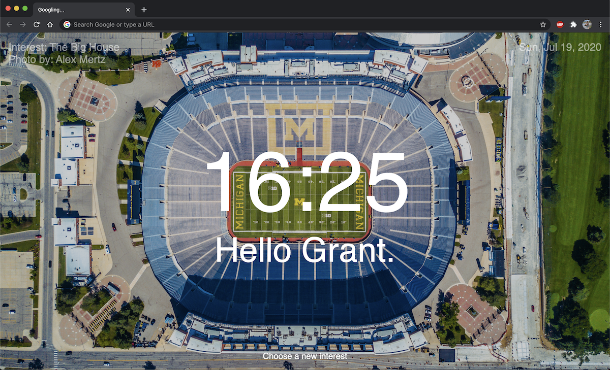
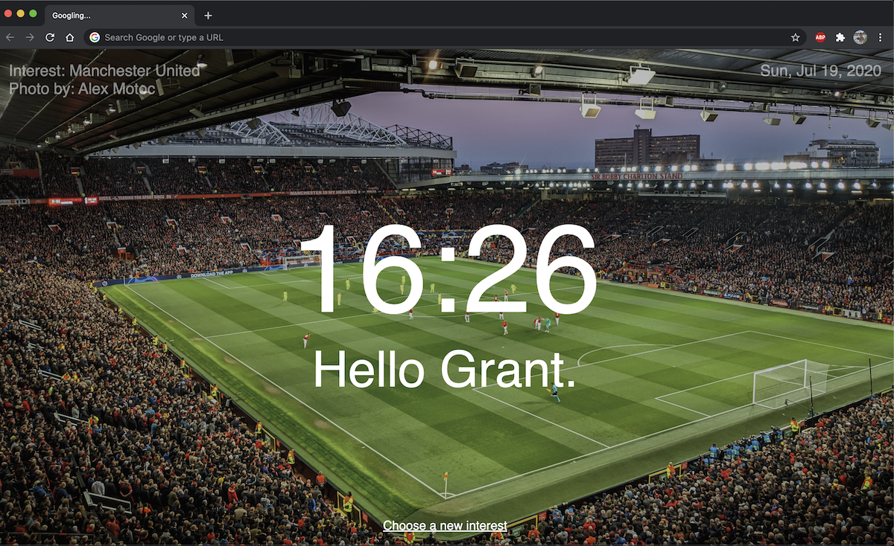

# Momentum-Chrome-App
To practice more JavaScript, I followed a tutorial by Jungwon Seo (https://medium.com/@thejungwon/best-html-css-javascript-practice-chrome-extension-ae4e5e7839e). This Chrome Extension is very similar to the popular Momentum Chrome Extension that displays a nature background, name, and time.

